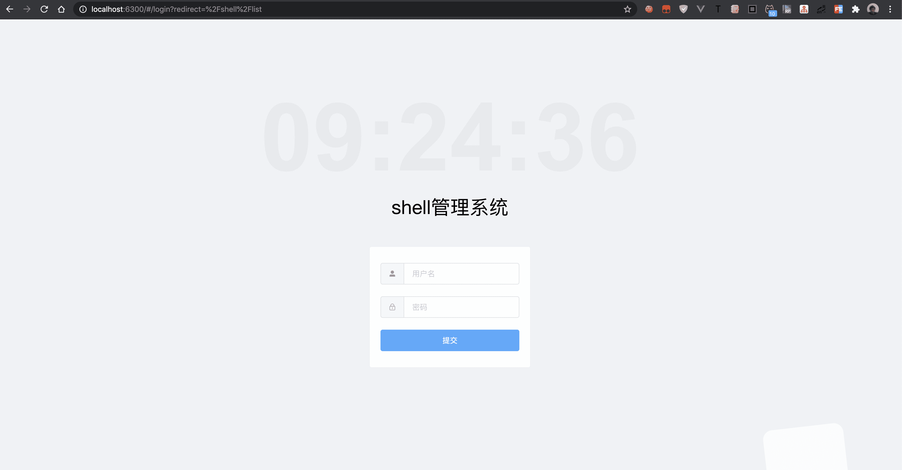
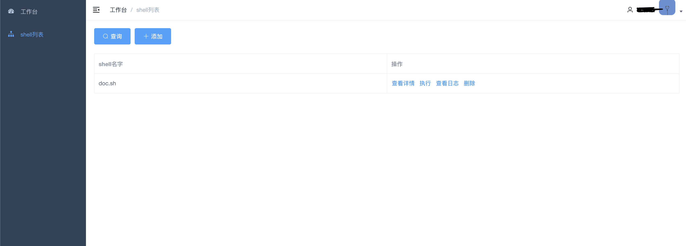
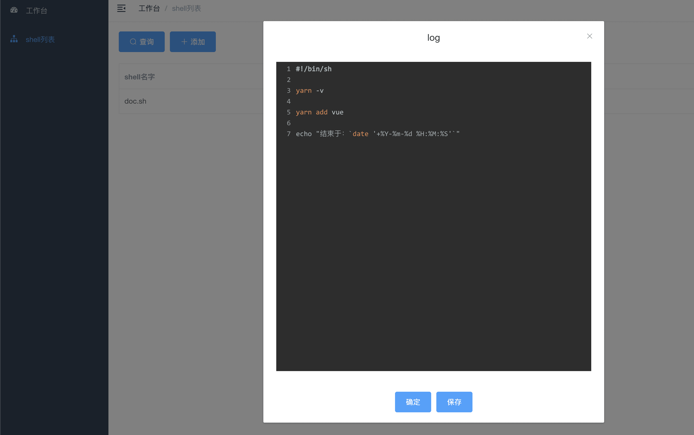
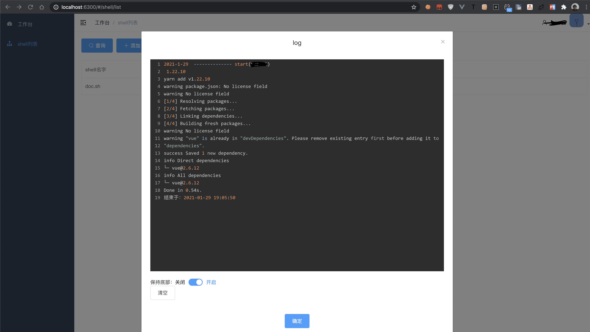

## shell Manage
-----
by Nodejs(koa2)
too simple --- without datebase

include egg (replace authManage)(keycodes: [38, 38, 40, 40, 37, 39, 37, 39, 66, 65])

how to install?
```bash

yarn

cd /build/new
yarn
yarn build

cd ..
pm2 start app.js --name shell_manage

```

what is pm2?
----
[pm2 simple learn(jianshu)](https://www.jianshu.com/p/e15fd72727fe)

[pm2 website](https://www.jianshu.com/p/e15fd72727fe)

## screenshots
----



